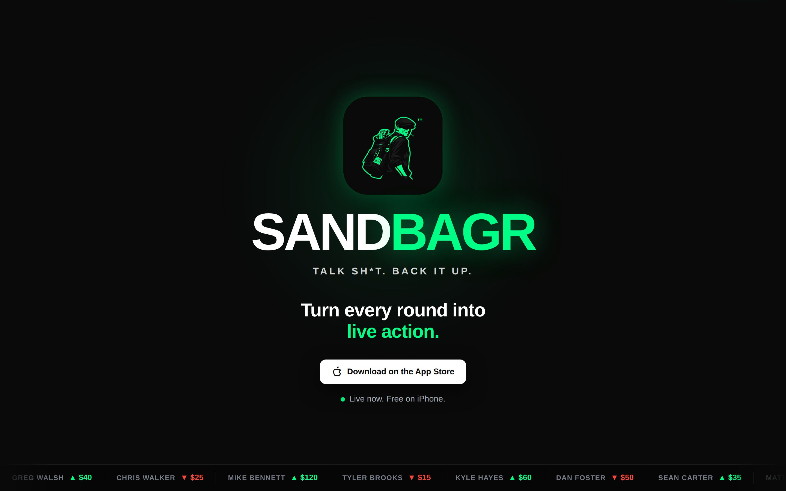
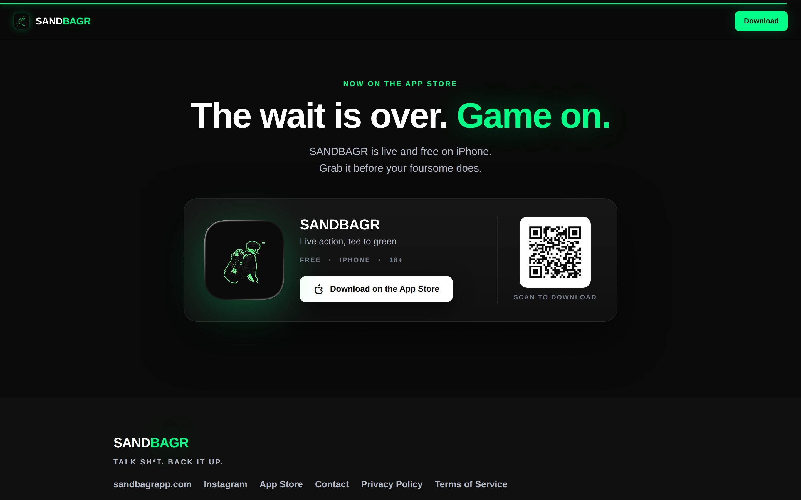
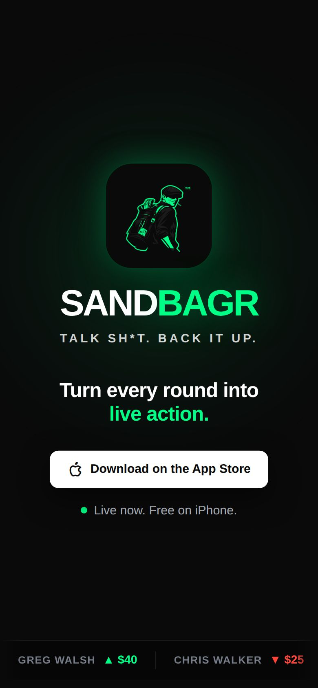
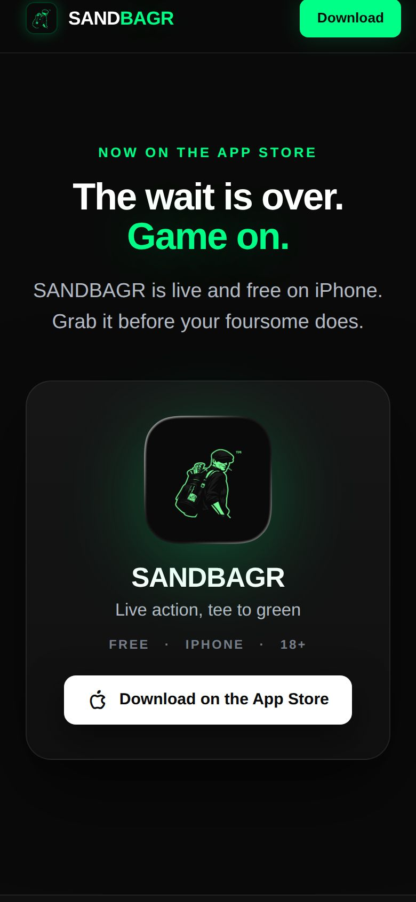

# SANDBAGR — sandbagrapp.com

Marketing site for the **SANDBAGR** iOS app. Static HTML/CSS/vanilla JS, hosted on Netlify,
auto-deployed from the `main` branch of this repo (base directory `site/`, no build step).
Push to `main` → live on https://sandbagrapp.com in about a minute.

**The app is live on the App Store** (Sept 2026):
https://apps.apple.com/us/app/sandbagr/id6769903712 — every call-to-action on the site
points there. The pre-launch waitlist ("The Line") has been retired.

## One page, two layouts — desktop vs. phone

The site is a single responsive page. The same HTML is served to everyone; CSS media
queries in `site/css/styles.css` change the layout by screen width (base styles are
mobile-first, `@media (min-width: …)` blocks add the wider layouts). Nothing is
device-sniffed — a narrow browser window on a Mac gets the phone layout.

| | Desktop / Mac (≥ 720px wide) | Phone |
|---|---|---|
| **Hero** | Icon + wordmark centered, white "Download on the App Store" button | Same, stacked for a narrow screen |
| **Sticky header** | Appears after you scroll past the hero: mark + wordmark, green "Download" pill | Same |
| **Download section** (bottom of page) | Three-column card: app icon · name / subtitle / button · **QR code** ("Scan to download") — because you can't install an iPhone app from a Mac, the QR hands the visitor off to their phone | Card stacks vertically and centers; the **QR is hidden** (they're already on the phone — the button opens the App Store directly) |
| **Apple Smart App Banner** | n/a | iPhone Safari shows Apple's native banner at the top of the page (`<meta name="apple-itunes-app">`) |
| **How-it-works screens** | Copy beside each phone screenshot, alternating sides | Screenshot above its copy |

Reference screenshots (taken from the code in this repo; system fonts, so type differs slightly from the live Inter):

| Desktop — top | Desktop — download section |
|---|---|
|  |  |

| Phone — top | Phone — download section |
|---|---|
|  |  |

The breakpoint for the download card is `@media (min-width: 720px)` in the
`LAUNCH` block at the bottom of `site/css/styles.css`.

## Where the App Store link lives

The listing URL appears in four places in `site/index.html` (sticky header, hero button,
download card button, footer link) plus two Netlify redirects in `site/netlify.toml`:

- `https://sandbagrapp.com/download` → App Store listing
- `https://sandbagrapp.com/app` → App Store listing

Use the short links in the Instagram bio, texts, and printed QR codes. The on-page QR
(`site/assets/qr-appstore.png`) encodes `/download`, so if the listing URL ever changes
(or an Android build ships), update the redirect and every printed QR keeps working.

## Structure

```
site/                     ← what Netlify publishes
  index.html              ← the page: Hero · Problem · Magic demo · Positioning · How it works · League · Download · Footer
  contact.html            ← contact form (Web3Forms)
  privacypolicy.html, terms.html
  css/styles.css          ← all styling; responsive rules are the @media blocks
  js/app.js               ← scroll choreography + self-running phone animations (GSAP, self-hosted in js/vendor/)
  js/contact.js
  assets/                 ← app-icon.png (favicon + download card), apple-touch-icon.png, qr-appstore.png,
                            mascot-mark.png (hero), screens/ (How-it-works screenshots)
  _headers                ← security headers + strict CSP
  netlify.toml            ← www→apex redirect, /download + /app short links, /backend/* blocked
  backend/Code.gs         ← retired Google Apps Script from the waitlist era (not served)
docs/                     ← reference screenshots for this README (not deployed)
context/                  ← design references only (not deployed)
```

## Run locally

```bash
cd site
python3 -m http.server 8000   # then open http://localhost:8000
```

To preview the phone layout on a Mac, open browser dev tools and toggle the device
toolbar (or just make the window narrower than 720px).

## Security

- **HTTPS everywhere** — Netlify TLS; `netlify.toml` forces `www → apex`; `_headers` sends HSTS.
- **Security headers** (`_headers`): HSTS, `nosniff`, `Referrer-Policy`, `X-Frame-Options`, `Permissions-Policy`.
- **Strict CSP** — `script-src 'self'` only; GSAP is self-hosted, no third-party JS runs.
  `connect-src` allows Web3Forms (contact form) and the old Apps Script origin (unused now).
- **No secrets in the client** — the Web3Forms access key in `contact.html` is a public key by design.
- Contact form has a honeypot field; submissions email the SANDBAGR inbox.

## Compliance

The footer compliance line is required and **verbatim** — do not edit it.
